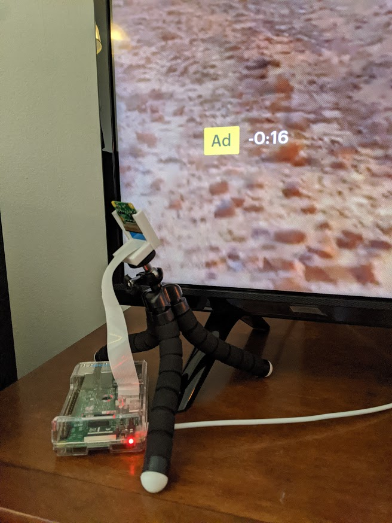
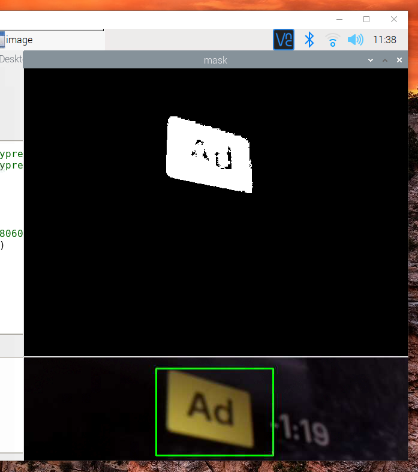

# Pimuter-for-Hulu
Reads the "Ad" symbol on Hulu ads and mutes the Roku TV using its API when present.
This could potentially work for hulu streaming sticks or boxes depending on how the volume control is set up with the tv.
Designed to run continuously, it checks every two minutes to see if Hulu is the active app and turns the image processing on or off accordingly to save power and heat that can shorten the pi's lifespan. A live view of the crop region and resulting mask is displayed for tuning the behavior. I'd suggest commenting these out to minimize the processing required of the pi when not tuning.

### How it Works
It crops the frame to the target region and creates a binary mask based on the pixel color being within a specified range. Then the mask is summed and compared to a threshold to determine if the "Ad" icon is present. The Roku API was very easy to use to send the mute and volume commands. To make sure the TV mute state doesn't get out of sync with the Pi, I toggle the volume up and down before muting. I tried optical character recognition with Tesseract but it was much less reliable. There are still some errors when the background colors are very similar to the target color when not in an ad, or when the background of the ad affects the exposure, despite trying to fix the exposure in code. Shape detection is a little tricky due to the skew required if you want the camera out of your view. The next step would be training a ML model to recognize the shape. Getting labeled training data shouldn't be hard so fork repo and try it!

### Required Changes for new Instantiations
Just change the IP address of your Roku device. You can adjust the size of the crop region but for now this is done separately from the rectangle selection. Will combine these in the future into one parameter.

### Pi Cam Setup at Bottom Left of Hulu Screen

### Live View of Crop Region and Mask

